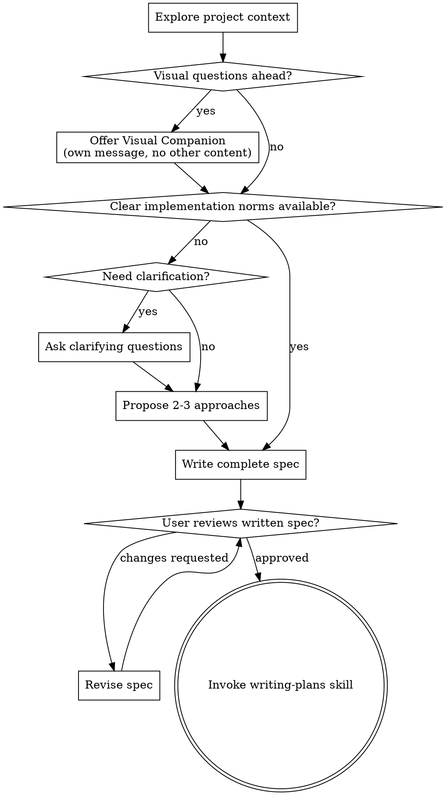

# Brainstorming Question Boundaries Implementation Plan

> **For agentic workers:** REQUIRED SUB-SKILL: Use superpowers:subagent-driven-development (recommended) or superpowers:executing-plans to implement this plan task-by-task. Steps use checkbox (`- [ ]`) syntax for tracking.

**Goal:** Update the `brainstorming` skill so it only asks questions when requirements are genuinely unclear or implementation choices are truly conflicting, and otherwise writes a complete spec directly for user review with a short summary.

**Architecture:** Keep the change tightly scoped to the `brainstorming` skill prompt plus behavior-focused shell validation. Modify the skill instructions so “ask questions” becomes a conditional branch instead of the default path, then add explicit test fixtures that exercise the three target scenarios: clear norms, vague requirements, and mutually exclusive approaches.

**Tech Stack:** Markdown skill files, bash-based Claude CLI behavior tests, grep/jq-based log assertions

---

## File Structure

- **Modify:** `skills/brainstorming/SKILL.md`
  - Change the checklist, process flow, “Understanding the idea”, “Presenting the design”, “Key Principles”, and user review wording so the skill:
    - prefers existing norms over clarification questions
    - skips inline section-by-section approval when information is already sufficient
    - writes a complete spec first, then presents a short summary for review
- **Create:** `tests/explicit-skill-requests/prompts/brainstorming-clear-norms.txt`
  - Prompt fixture for the “clear norms, no questions needed” scenario
- **Create:** `tests/explicit-skill-requests/prompts/brainstorming-vague-requirements.txt`
  - Prompt fixture for the “requirements are vague, clarification is required” scenario
- **Create:** `tests/explicit-skill-requests/prompts/brainstorming-conflicting-approaches.txt`
  - Prompt fixture for the “multiple mutually exclusive approaches exist” scenario
- **Create:** `tests/explicit-skill-requests/run-brainstorming-boundary-test.sh`
  - Standalone validation script that runs Claude against the plugin and asserts the new branching behavior from streamed JSON logs
- **Optional modify only if the new test is stable in local runs:** `tests/explicit-skill-requests/run-all.sh`
  - Add the new boundary test to the suite entrypoint after manual validation proves it is reliable

## Task 1: Update the checklist and process flow in the brainstorming skill

**Files:**
- Modify: `skills/brainstorming/SKILL.md:20-66`
- Test: `tests/explicit-skill-requests/run-brainstorming-boundary-test.sh`

- [ ] **Step 1: Write the failing behavior test for the clear-norms path**

Create `tests/explicit-skill-requests/prompts/brainstorming-clear-norms.txt` with this exact content:

```text
I need to optimize the brainstorming skill in this plugin.

The repository already has a standard spec location under docs/superpowers/specs.
Use existing repository conventions.
Ask questions only if the business definition is unclear or if there are mutually exclusive implementation options.
If the norms are already clear, write the complete spec directly and then give me only a short summary for review.
```

Create `tests/explicit-skill-requests/run-brainstorming-boundary-test.sh` with this initial structure:

```bash
#!/usr/bin/env bash
set -euo pipefail

SCRIPT_DIR="$(cd "$(dirname "${BASH_SOURCE[0]}")" && pwd)"
PLUGIN_DIR="$(cd "$SCRIPT_DIR/../.." && pwd)"
PROMPTS_DIR="$SCRIPT_DIR/prompts"

TIMESTAMP=$(date +%s)
OUTPUT_DIR="/tmp/superpowers-tests/${TIMESTAMP}/brainstorming-boundaries"
PROJECT_DIR="$OUTPUT_DIR/project"
LOG_CLEAR="$OUTPUT_DIR/clear-norms.json"

mkdir -p "$PROJECT_DIR/docs/superpowers/specs" "$OUTPUT_DIR"
cd "$PROJECT_DIR"

PROMPT_CLEAR=$(cat "$PROMPTS_DIR/brainstorming-clear-norms.txt")

timeout 300 claude -p "$PROMPT_CLEAR" \
  --plugin-dir "$PLUGIN_DIR" \
  --dangerously-skip-permissions \
  --max-turns 4 \
  --output-format stream-json \
  > "$LOG_CLEAR" 2>&1 || true

if ! grep -q 'docs/superpowers/specs/' "$LOG_CLEAR"; then
  echo "FAIL: clear-norms scenario did not mention spec output path"
  exit 1
fi

if grep -qiE 'what (should|do you)|which option|can you clarify|want me to' "$LOG_CLEAR"; then
  echo "FAIL: clear-norms scenario asked an unnecessary clarification question"
  exit 1
fi

echo "PASS: clear-norms scenario wrote spec without unnecessary questions"
```

- [ ] **Step 2: Run the test to verify it fails before the skill change**

Run:

```bash
bash tests/explicit-skill-requests/run-brainstorming-boundary-test.sh
```

Expected: FAIL because the current `brainstorming` skill still encourages clarification questions and does not explicitly enforce the “write complete spec directly” path.

- [ ] **Step 3: Update the checklist and process flow text in `skills/brainstorming/SKILL.md`**

Replace the checklist item at `skills/brainstorming/SKILL.md:24-32` with this block:

```markdown
1. **Explore project context** — check files, docs, recent commits
2. **Offer visual companion** (if topic will involve visual questions) — this is its own message, not combined with a clarifying question. See the Visual Companion section below.
3. **Decide whether clarification is actually needed** — identify whether existing norms already define the implementation path
4. **Ask clarifying questions only when needed** — one at a time, only to resolve true ambiguity, missing implementation detail, or mutually exclusive approaches
5. **Propose 2-3 approaches** — with trade-offs and your recommendation when a real decision remains
6. **Write the complete design/spec** — when information is sufficient, generate the full spec instead of confirming design sections one by one
7. **Write design doc** — save to `docs/superpowers/specs/YYYY-MM-DD-<topic>-design.md` and commit
8. **Spec self-review** — quick inline check for placeholders, contradictions, ambiguity, scope (see below)
9. **User reviews written spec** — ask user to review the spec file before proceeding
10. **Transition to implementation** — invoke writing-plans skill to create implementation plan
```

Replace the process-flow graph at `skills/brainstorming/SKILL.md:36-64` with this block:



- [ ] **Step 4: Run the clear-norms test again**

Run:

```bash
bash tests/explicit-skill-requests/run-brainstorming-boundary-test.sh
```

Expected: the clear-norms assertions get past the “asked unnecessary clarification question” failure point, though later assertions may still fail until the rest of the skill text is updated.

- [ ] **Step 5: Commit the first slice**

```bash
git add skills/brainstorming/SKILL.md tests/explicit-skill-requests/prompts/brainstorming-clear-norms.txt tests/explicit-skill-requests/run-brainstorming-boundary-test.sh
git commit -m "refactor: make brainstorming clarification conditional"
```

## Task 2: Update the main behavior rules so norms-first and full-spec-first are explicit

**Files:**
- Modify: `skills/brainstorming/SKILL.md:68-145`
- Test: `tests/explicit-skill-requests/run-brainstorming-boundary-test.sh`

- [ ] **Step 1: Extend the failing test to cover vague and conflicting scenarios**

Create `tests/explicit-skill-requests/prompts/brainstorming-vague-requirements.txt` with this exact content:

```text
I want to make the brainstorming skill better.
Please use the brainstorming skill.
```

Create `tests/explicit-skill-requests/prompts/brainstorming-conflicting-approaches.txt` with this exact content:

```text
I need to change the brainstorming skill in this repository.
There are two possible directions: keep step-by-step user confirmations, or generate a complete spec first and ask for one review at the end.
Assume the repository does not already say which approach wins.
Please think this through with me.
```

Update `tests/explicit-skill-requests/run-brainstorming-boundary-test.sh` to this fuller version:

```bash
#!/usr/bin/env bash
set -euo pipefail

SCRIPT_DIR="$(cd "$(dirname "${BASH_SOURCE[0]}")" && pwd)"
PLUGIN_DIR="$(cd "$SCRIPT_DIR/../.." && pwd)"
PROMPTS_DIR="$SCRIPT_DIR/prompts"

TIMESTAMP=$(date +%s)
OUTPUT_DIR="/tmp/superpowers-tests/${TIMESTAMP}/brainstorming-boundaries"
mkdir -p "$OUTPUT_DIR"

run_case() {
  local name="$1"
  local prompt_file="$2"
  local log_file="$OUTPUT_DIR/${name}.json"
  local project_dir="$OUTPUT_DIR/${name}-project"

  mkdir -p "$project_dir/docs/superpowers/specs"
  cd "$project_dir"

  local prompt
  prompt=$(cat "$prompt_file")

  timeout 300 claude -p "$prompt" \
    --plugin-dir "$PLUGIN_DIR" \
    --dangerously-skip-permissions \
    --max-turns 4 \
    --output-format stream-json \
    > "$log_file" 2>&1 || true

  printf '%s\n' "$log_file"
}

assert_contains() {
  local pattern="$1"
  local file="$2"
  local message="$3"
  if ! grep -qiE "$pattern" "$file"; then
    echo "FAIL: $message"
    exit 1
  fi
}

assert_not_contains() {
  local pattern="$1"
  local file="$2"
  local message="$3"
  if grep -qiE "$pattern" "$file"; then
    echo "FAIL: $message"
    exit 1
  fi
}

LOG_CLEAR=$(run_case clear-norms "$PROMPTS_DIR/brainstorming-clear-norms.txt")
assert_contains 'docs/superpowers/specs/' "$LOG_CLEAR" 'clear-norms scenario should mention the spec output path'
assert_not_contains 'what (should|do you)|which option|can you clarify|want me to' "$LOG_CLEAR" 'clear-norms scenario should not ask unnecessary questions'
assert_contains 'summary|overview|quick review' "$LOG_CLEAR" 'clear-norms scenario should provide a short review summary'

echo 'PASS: clear-norms scenario'

LOG_VAGUE=$(run_case vague "$PROMPTS_DIR/brainstorming-vague-requirements.txt")
assert_contains '\?' "$LOG_VAGUE" 'vague scenario should ask at least one question'
echo 'PASS: vague scenario'

LOG_CONFLICT=$(run_case conflict "$PROMPTS_DIR/brainstorming-conflicting-approaches.txt")
assert_contains 'approach|option|trade-?off|recommend' "$LOG_CONFLICT" 'conflict scenario should discuss competing approaches'
assert_contains '\?' "$LOG_CONFLICT" 'conflict scenario should ask for clarification when norms do not resolve the choice'
echo 'PASS: conflicting-approaches scenario'

echo "All brainstorming boundary checks passed. Logs: $OUTPUT_DIR"
```

- [ ] **Step 2: Run the expanded boundary test to verify current behavior still fails**

Run:

```bash
bash tests/explicit-skill-requests/run-brainstorming-boundary-test.sh
```

Expected: at least one scenario fails against the pre-change or partially changed skill text.

- [ ] **Step 3: Update the “Understanding the idea”, “Presenting the design”, and “Key Principles” sections**

In `skills/brainstorming/SKILL.md`, replace the `## The Process` and `## Key Principles` body from the start of `**Understanding the idea:**` through the end of the key-principles list with this exact content:

```markdown
## The Process

**Understanding the idea:**

- Check out the current project state first (files, docs, recent commits)
- Before asking detailed questions, assess scope: if the request describes multiple independent subsystems (e.g., "build a platform with chat, file storage, billing, and analytics"), flag this immediately. Don't spend questions refining details of a project that needs to be decomposed first.
- If the project is too large for a single spec, help the user decompose into sub-projects: what are the independent pieces, how do they relate, what order should they be built? Then brainstorm the first sub-project through the normal design flow. Each sub-project gets its own spec → plan → implementation cycle.
- Before asking any clarifying question, determine whether the repository and the current conversation already define a clear implementation path.
- Treat existing docs, stable code patterns, and explicit user instructions as implementation norms.
- If those norms already answer the key design questions, do not ask clarifying questions. Proceed directly to the complete design/spec, write it to the standard location, and present a short summary for review.
- For appropriately-scoped projects without a clear implementation path, ask questions one at a time to refine the idea.
- Prefer multiple choice questions when possible, but open-ended is fine too.
- Only one question per message. If a topic needs more exploration, break it into multiple questions.
- Focus questions on what is required to resolve purpose, constraints, success criteria, or mutually exclusive implementation paths.
- Never ask a question whose answer is already clear from repository norms or explicit user instructions.

**Exploring approaches:**

- Propose 2-3 different approaches with trade-offs when a real design choice remains.
- Present options conversationally with your recommendation and reasoning.
- Lead with your recommended option and explain why.
- If repository norms already determine the path, do not invent artificial alternatives just to satisfy the workflow.

**Presenting the design:**

- Once you believe you understand what you're building, write the complete design/spec.
- When the user already supplied enough information, do not present the design in section-by-section approval loops.
- Instead, write the complete spec to the standard location and present a short summary that helps the user review it quickly.
- If earlier clarification exposed a real design decision, make that decision explicit in the spec and include the trade-off in your summary.
- Cover: architecture, components, data flow, error handling, testing.
- Be ready to revise the written spec if something doesn't make sense.

**Design for isolation and clarity:**

- Break the system into smaller units that each have one clear purpose, communicate through well-defined interfaces, and can be understood and tested independently.
- For each unit, you should be able to answer: what does it do, how do you use it, and what does it depend on?
- Can someone understand what a unit does without reading its internals? Can you change the internals without breaking consumers? If not, the boundaries need work.
- Smaller, well-bounded units are also easier for you to work with - you reason better about code you can hold in context at once, and your edits are more reliable when files are focused. When a file grows large, that's often a signal that it's doing too much.

**Working in existing codebases:**

- Explore the current structure before proposing changes. Follow existing patterns.
- Where existing code has problems that affect the work (e.g., a file that's grown too large, unclear boundaries, tangled responsibilities), include targeted improvements as part of the design - the way a good developer improves code they're working in.
- Don't propose unrelated refactoring. Stay focused on what serves the current goal.

## Key Principles

- **Norms first** - If the project already has clear implementation norms, follow them and skip unnecessary questions.
- **One question at a time when questions are necessary** - Don't overwhelm the user when real clarification is needed.
- **Multiple choice preferred** - Easier to answer than open-ended when possible.
- **YAGNI ruthlessly** - Remove unnecessary features from all designs.
- **Explore alternatives only when real choices remain** - Don't manufacture options when the path is already determined.
- **Review at the spec level** - When information is sufficient, write the full spec first and ask the user to review the document rather than approving design sections one by one.
- **Be flexible** - Go back and clarify when something doesn't make sense.
```

- [ ] **Step 4: Update the user review gate wording so it requests one review of the written spec plus a summary**

Replace the `User Review Gate` example text at `skills/brainstorming/SKILL.md:126-131` with:

```markdown
**User Review Gate:**
After the spec review loop passes, ask the user to review the written spec before proceeding. Give them the file path plus a short summary of the main decisions and boundaries:

> "Spec written to `<path>`. Summary: <2-4 sentence overview of the key design decisions, changed behavior, and review focus>. Please review the spec and let me know if you want any changes before we start writing the implementation plan."

Wait for the user's response. If they request changes, make them and re-run the spec review loop. Only proceed once the user approves.
```

- [ ] **Step 5: Run the expanded boundary test again**

Run:

```bash
bash tests/explicit-skill-requests/run-brainstorming-boundary-test.sh
```

Expected: PASS for all three scenarios, with the clear-norms path avoiding unnecessary questions, the vague path asking at least one question, and the conflict path explicitly engaging with competing approaches.

- [ ] **Step 6: Commit the behavior rules slice**

```bash
git add skills/brainstorming/SKILL.md tests/explicit-skill-requests/prompts/brainstorming-vague-requirements.txt tests/explicit-skill-requests/prompts/brainstorming-conflicting-approaches.txt tests/explicit-skill-requests/run-brainstorming-boundary-test.sh
git commit -m "refactor: tighten brainstorming question boundaries"
```

## Task 3: Decide whether to integrate the new behavior test into the explicit-skill test suite

**Files:**
- Modify if stable: `tests/explicit-skill-requests/run-all.sh`
- Test: `tests/explicit-skill-requests/run-all.sh`

- [ ] **Step 1: Run the standalone boundary test twice to check for flakiness**

Run:

```bash
bash tests/explicit-skill-requests/run-brainstorming-boundary-test.sh && bash tests/explicit-skill-requests/run-brainstorming-boundary-test.sh
```

Expected: both runs PASS with the same three scenario summaries.

- [ ] **Step 2: If the test is stable, add it to `run-all.sh`; otherwise leave the suite entrypoint unchanged**

If stable, insert this block after the existing brainstorming explicit-skill test in `tests/explicit-skill-requests/run-all.sh`:

```bash
# Test: brainstorming boundary behavior
 echo ">>> Test 4: brainstorming-boundary-behavior"
 if "$SCRIPT_DIR/run-brainstorming-boundary-test.sh"; then
     PASSED=$((PASSED + 1))
     RESULTS="$RESULTS\nPASS: brainstorming-boundary-behavior"
 else
     FAILED=$((FAILED + 1))
     RESULTS="$RESULTS\nFAIL: brainstorming-boundary-behavior"
 fi
 echo ""
```

If the test is not stable, do not modify `run-all.sh`. Instead, keep the boundary test as a standalone targeted validation script.

- [ ] **Step 3: Run the suite entrypoint only if you modified it**

Run:

```bash
bash tests/explicit-skill-requests/run-all.sh
```

Expected: PASS for the existing explicit-skill tests plus the new brainstorming boundary test.

- [ ] **Step 4: Commit the suite integration only if it happened**

If `run-all.sh` changed:

```bash
git add tests/explicit-skill-requests/run-all.sh tests/explicit-skill-requests/run-brainstorming-boundary-test.sh
git commit -m "test: cover brainstorming boundary behavior"
```

If `run-all.sh` did not change, skip this commit.

## Task 4: Final verification and handoff

**Files:**
- Modify if needed: `skills/brainstorming/SKILL.md`
- Modify if needed: `tests/explicit-skill-requests/run-brainstorming-boundary-test.sh`

- [ ] **Step 1: Run the targeted verification commands and save the output**

Run:

```bash
bash tests/explicit-skill-requests/run-brainstorming-boundary-test.sh
```

Expected: all three boundary scenarios PASS.

Then run:

```bash
grep -n "Ask clarifying questions only when needed\|Norms first\|Review at the spec level\|Spec written to" skills/brainstorming/SKILL.md
```

Expected output includes four matching lines proving the new branching rules and review wording are present.

- [ ] **Step 2: Review the final diff for scope discipline**

Run:

```bash
git diff -- skills/brainstorming/SKILL.md tests/explicit-skill-requests/
```

Expected: diff is limited to the brainstorming skill text plus the new boundary-validation fixtures/scripts.

- [ ] **Step 3: Create the final implementation commit**

If Task 3 did not produce a suite-integration commit, create the final commit now:

```bash
git add skills/brainstorming/SKILL.md tests/explicit-skill-requests/prompts/brainstorming-clear-norms.txt tests/explicit-skill-requests/prompts/brainstorming-vague-requirements.txt tests/explicit-skill-requests/prompts/brainstorming-conflicting-approaches.txt tests/explicit-skill-requests/run-brainstorming-boundary-test.sh
git commit -m "refactor: streamline brainstorming spec generation"
```

If Task 3 already produced the last needed commit, skip this step.

- [ ] **Step 4: Prepare the human review summary**

Share:

```text
Changed files:
- skills/brainstorming/SKILL.md
- tests/explicit-skill-requests/prompts/brainstorming-clear-norms.txt
- tests/explicit-skill-requests/prompts/brainstorming-vague-requirements.txt
- tests/explicit-skill-requests/prompts/brainstorming-conflicting-approaches.txt
- tests/explicit-skill-requests/run-brainstorming-boundary-test.sh
- tests/explicit-skill-requests/run-all.sh (only if suite integration was proven stable)

Verified behavior:
- clear norms => writes spec without unnecessary clarification questions
- vague requirements => asks a clarifying question
- conflicting approaches => discusses trade-offs and asks for the missing decision
```
```

## Self-Review

- **Spec coverage:** This plan covers the spec's four functional requirements: conditional clarification, norms-first detection, full-spec-first review flow, and short summary after spec generation. It also covers the spec's verification requirement with explicit clear/vague/conflict scenarios.
- **Placeholder scan:** No `TBD`, `TODO`, or hand-wavy implementation steps remain. Each code-modifying step contains concrete replacement content or exact file contents.
- **Type consistency:** File names, prompt names, script names, and grep assertions are consistent throughout the plan.
