# TDD E2E First Implementation Plan

> **For agentic workers:** REQUIRED SUB-SKILL: Use superpowers:subagent-driven-development (recommended) or superpowers:executing-plans to implement this plan task-by-task. Steps use checkbox (`- [ ]`) syntax for tracking.

**Goal:** 将 `test-driven-development` 技能重构为“默认以复杂输入的 E2E / 集成级 failing test 起步，失败或异常时再下钻到小粒度测试”的新主流程，并同步更新最小必要的测试资产与对外描述。

**Architecture:** 这次改动以 `skills/test-driven-development/SKILL.md` 为核心，围绕它做三类同步更新：一是补充/改造行为测试与显式技能请求测试资产，确保新流程可被识别；二是修正 `subagent-driven-development` 与 `README.md` 中对 TDD 的描述，使仓库话术与新流程一致；三是保持 `verification-before-completion` 只作为完成前验证技能，不把“小粒度补测”重新引回默认门槛。执行时不要运行 `tests/` 目录下脚本，改动完成后由人审阅内容。

**Tech Stack:** Markdown（技能与文档）、bash 测试资产、Claude Code CLI stream-json 测试约定

**Spec:** `docs/superpowers/specs/2026-05-14-tdd-e2e-first-design.md`

**Execution Constraints:** 不运行 `tests/` 目录下任何脚本；只创建或修改测试资产；完成后由用户人工审核内容，不以脚本跑通作为完成判据。

---

### Task 1: 建立 E2E-first 行为测试资产

**Files:**
- Create: `tests/claude-code/test-tdd-e2e-first.sh`
- Modify: `tests/claude-code/run-skill-tests.sh`
- Read: `tests/claude-code/test-helpers.sh`
- Read: `skills/test-driven-development/SKILL.md`

- [ ] **Step 1: 创建新的 Claude Code 行为测试脚本**

写入 `tests/claude-code/test-tdd-e2e-first.sh`，内容如下：

```bash
#!/usr/bin/env bash
# Test: test-driven-development skill follows E2E-first workflow
set -euo pipefail

SCRIPT_DIR="$(cd "$(dirname "$0")" && pwd)"
source "$SCRIPT_DIR/test-helpers.sh"

echo "=== Test: test-driven-development skill (E2E-first) ==="
echo ""

# Test 1: 默认从大粒度测试起步
# 这里不要求 Claude 真写代码，只验证它如何描述 TDD 起手式

echo "Test 1: E2E-first default..."
output=$(run_claude "In the test-driven-development skill, for a normal feature request in a workflow-heavy codebase, what kind of failing test should come first? Answer briefly." 30)

if assert_contains "$output" "E2E\|end-to-end\|integration" "Mentions E2E or integration first"; then
    :
else
    exit 1
fi

echo ""

# Test 2: 第一条测试应带复杂输入

echo "Test 2: Complex input requirement..."
output=$(run_claude "According to the test-driven-development skill, should the first failing test use a trivial happy-path input or a relatively complex input?" 30)

if assert_contains "$output" "complex\|complexity\|realistic\|representative" "Requires relatively complex input"; then
    :
else
    exit 1
fi

if assert_not_contains "$output" "trivial happy-path only\|only the simplest" "Does not prefer trivial happy-path only"; then
    :
else
    exit 1
fi

echo ""

# Test 3: 不默认补齐小粒度测试

echo "Test 3: No automatic unit-test backfill..."
output=$(run_claude "If the large-granularity E2E test passes cleanly, does the test-driven-development skill require adding unit tests for every new function anyway?" 30)

if assert_contains "$output" "no\|not required\|does not require\|only if" "Does not require blanket unit-test backfill"; then
    :
else
    exit 1
fi

echo ""

# Test 4: 只有失败或异常时才下钻

echo "Test 4: Escalate down only on failure or anomalies..."
output=$(run_claude "When does the test-driven-development skill allow dropping down from E2E tests to smaller unit or module tests?" 30)

if assert_contains "$output" "fail\|failure\|flaky\|timing\|performance\|stability" "Mentions failure or anomalies as trigger"; then
    :
else
    exit 1
fi

if assert_not_contains "$output" "always start with unit tests\|normally begin with unit tests" "Does not fall back to unit tests by default"; then
    :
else
    exit 1
fi

echo ""

# Test 5: 天然不适合 E2E 的例外路径

echo "Test 5: Exception path for non-E2E tasks..."
output=$(run_claude "If the task is a pure utility function with no natural end-to-end flow, what does the test-driven-development skill say to do first?" 30)

if assert_contains "$output" "unit\|module\|smaller-scope\|local test" "Allows smaller-scope tests for non-E2E tasks"; then
    :
else
    exit 1
fi

if assert_contains "$output" "test-first\|failing test first" "Keeps test-first even in exception path"; then
    :
else
    exit 1
fi

echo ""
echo "=== All test-driven-development E2E-first tests passed ==="
```

- [ ] **Step 2: 把新测试加入 `run-skill-tests.sh` 的快测列表**

在 `tests/claude-code/run-skill-tests.sh` 里，把 `tests` 数组从：

```bash
tests=(
    "test-subagent-driven-development.sh"
)
```

改成：

```bash
tests=(
    "test-subagent-driven-development.sh"
    "test-tdd-e2e-first.sh"
)
```

并把 `--help` 输出中的 Tests 段从：

```bash
echo "  test-subagent-driven-development.sh  Test skill loading and requirements"
```

改成：

```bash
echo "  test-subagent-driven-development.sh  Test skill loading and requirements"
echo "  test-tdd-e2e-first.sh               Test TDD skill E2E-first workflow"
```

- [ ] **Step 3: 人工核对新增测试脚本内容，不运行脚本**

人工检查以下几点：
- `tests/claude-code/test-tdd-e2e-first.sh` 只验证技能行为表述，不依赖真实项目代码
- 每个断言都对应 spec 中一条关键行为
- 没有调用 `tests/` 目录下其他脚本作为执行步骤

预期：文件内容完整、可读、与 spec 对齐。

- [ ] **Step 4: 提交测试资产改动**

```bash
git add tests/claude-code/test-tdd-e2e-first.sh tests/claude-code/run-skill-tests.sh
git commit -m "test: add E2E-first coverage for TDD skill"
```

---

### Task 2: 增加显式技能请求用例资产

**Files:**
- Create: `tests/explicit-skill-requests/prompts/use-test-driven-development.txt`
- Modify: `tests/explicit-skill-requests/run-all.sh`
- Read: `tests/explicit-skill-requests/run-test.sh`
- Read: `tests/explicit-skill-requests/prompts/please-use-brainstorming.txt`
- Read: `tests/explicit-skill-requests/prompts/use-systematic-debugging.txt`

- [ ] **Step 1: 新增显式请求 TDD 的 prompt 文件**

创建 `tests/explicit-skill-requests/prompts/use-test-driven-development.txt`，内容如下：

```text
use test-driven-development to implement this
```

- [ ] **Step 2: 把新 prompt 接入 `run-all.sh`**

在 `tests/explicit-skill-requests/run-all.sh` 中，紧接在 systematic-debugging 测试后加入：

```bash
# Test: use test-driven-development

echo ">>> Test 3: use-test-driven-development"
if "$SCRIPT_DIR/run-test.sh" "test-driven-development" "$PROMPTS_DIR/use-test-driven-development.txt"; then
    PASSED=$((PASSED + 1))
    RESULTS="$RESULTS\nPASS: use-test-driven-development"
else
    FAILED=$((FAILED + 1))
    RESULTS="$RESULTS\nFAIL: use-test-driven-development"
fi
echo ""
```

然后将原有后续测试编号顺延：
- `please-use-brainstorming` 从 Test 3 改为 Test 4
- `mid-conversation-execute-plan` 从 Test 4 改为 Test 5

- [ ] **Step 3: 人工核对显式请求测试资产，不运行脚本**

检查：
- 新 prompt 风格与现有 prompt 文件一致，保持极简
- `run-all.sh` 中 skill 名为 `test-driven-development`
- 没有额外引入执行逻辑或环境依赖

预期：显式请求测试资产已完整接入，但不执行。

- [ ] **Step 4: 提交显式请求测试资产改动**

```bash
git add tests/explicit-skill-requests/prompts/use-test-driven-development.txt tests/explicit-skill-requests/run-all.sh
git commit -m "test: add explicit request coverage for TDD skill"
```

---

### Task 3: 重写 `test-driven-development` 技能正文

**Files:**
- Modify: `skills/test-driven-development/SKILL.md`
- Read: `docs/superpowers/specs/2026-05-14-tdd-e2e-first-design.md`

- [ ] **Step 1: 更新 frontmatter 与 Overview，明确大粒度 test-first 主张**

把文件头部从：

```markdown
---
name: test-driven-development
description: Use when implementing any feature or bugfix, before writing implementation code
---

# Test-Driven Development (TDD)

## Overview

Write the test first. Watch it fail. Write minimal code to pass.

**Core principle:** If you didn't watch the test fail, you don't know if it tests the right thing.
```

改成：

```markdown
---
name: test-driven-development
description: Use when implementing any feature or bugfix, before writing implementation code
---

# Test-Driven Development (TDD)

## Overview

Write the test first. By default, start with a relatively complex E2E or integration test that proves the real workflow should work. Only drop to smaller tests when the larger test fails or exposes stability/performance issues.

**Core principle:** If you didn't watch the test fail, you don't know if it tests the right thing.

**Default stance:** Prove the full behavior path first. Use smaller tests to diagnose, not as the automatic starting ritual.
```

- [ ] **Step 2: 重写 When to Use 与 The Iron Law 周边说明**

将 `## When to Use` 和 `## The Iron Law` 下方文字改成以下内容：

````markdown
## When to Use

**Always:**
- New features
- Bug fixes
- Refactoring
- Behavior changes

**Default starting point:**
- Workflow-heavy features
- Cross-file behavior changes
- User-visible flows
- Skill behavior or orchestration changes

**Exception path (still test-first):**
- Pure utility functions
- Pure parsing/transform logic
- Low-level modules with no natural end-to-end flow

Thinking "skip TDD just this once"? Stop. That's rationalization.

## The Iron Law

```
NO PRODUCTION CODE WITHOUT A FAILING TEST FIRST
```

By default, that failing test should be a relatively complex E2E or integration test that exercises the real behavior path.

Write code before the test? Delete it. Start over.

**No exceptions:**
- Don't keep it as "reference"
- Don't "adapt" it while writing tests
- Don't look at it
- Delete means delete

Implement fresh from tests. Period.
````

- [ ] **Step 3: 把 Red-Green-Refactor 改成两层漏斗流程**

将 `## Red-Green-Refactor` 及其后面三个阶段说明整体替换为下面这段：

````markdown
## Red-Green-Refactor

```dot
digraph tdd_cycle {
    rankdir=LR;
    red [label="RED\nWrite failing E2E/integration test", shape=box, style=filled, fillcolor="#ffcccc"];
    verify_red [label="Verify fails\nfor expected reason", shape=diamond];
    green [label="GREEN\nMinimal implementation", shape=box, style=filled, fillcolor="#ccffcc"];
    verify_green [label="Verify large test\npasses cleanly", shape=diamond];
    down [label="Drop down\nto smaller tests?", shape=diamond];
    diagnose [label="Write focused module/unit tests\nto diagnose", shape=box, style=filled, fillcolor="#fff2cc"];
    refactor [label="REFACTOR\nClean up", shape=box, style=filled, fillcolor="#ccccff"];
    next [label="Next", shape=ellipse];

    red -> verify_red;
    verify_red -> green [label="yes"];
    verify_red -> red [label="wrong failure"];
    green -> verify_green;
    verify_green -> down [label="yes"];
    verify_green -> green [label="no"];
    down -> refactor [label="no"];
    down -> diagnose [label="yes"];
    diagnose -> green [label="fix root cause"];
    refactor -> next;
}
```



### RED - Write the first failing test at the right level

For normal feature work, start by writing one relatively complex E2E or integration test that proves the real workflow should work.

That first test should:
- Cover the main value path, not an internal helper
- Use a relatively complex, representative input
- Fail because the feature is missing or behavior is wrong

If the task has no natural end-to-end flow, use a smaller-scope failing test instead — but still start with the highest level that naturally expresses the behavior.

### Verify RED - Watch it fail

**MANDATORY. Never skip.**

Run the test you just wrote and confirm:
- It fails (not errors)
- It fails for the expected reason
- The failure corresponds to missing behavior, not a typo or broken harness

If it passes immediately, you're not testing the new behavior.

### GREEN - Implement just enough to satisfy the large test

Write the minimum implementation needed to make the large-granularity test pass.

Do not start by scattering unit tests across internal helpers unless the large test failure forces you to investigate.

### Drop down only when warranted

Smaller module or unit tests are for diagnosis, not default ceremony.

Drop down only when:
- The large test fails and the root cause is unclear
- The behavior is flaky, timing-sensitive, or unstable
- Performance or resource issues need local isolation

Once the issue is understood and fixed, return to the large test and prove the full path still works.

### REFACTOR - Clean up after the full path is stable

After the large test passes reliably:
- Remove duplication
- Improve names
- Simplify structure

Do not backfill unit tests for every new function by default. Add smaller tests only where they continue to carry diagnostic or regression value.
````

- [ ] **Step 4: 更新 Good Tests、Common Rationalizations、Red Flags、Verification Checklist**

用下面内容替换对应章节的核心条目：

```markdown
## Good Tests

| Quality | Good | Bad |
|---------|------|-----|
| **Right starting level** | First test proves the real workflow | First test only checks an internal helper by habit |
| **Representative input** | Uses relatively complex, realistic input | Uses only trivial happy-path input |
| **Diagnostic drop-down** | Smaller tests appear after failure signals | Smaller tests are the automatic starting ritual |
| **Clear** | Name describes behavior | `test('test1')` |

## Common Rationalizations

| Excuse | Reality |
|--------|---------|
| "I'll start with a few unit tests to be safe" | That drags you into local loops before proving the real path. |
| "E2E is too big, I'll add it after implementation" | That's tests-after, not TDD. |
| "The big test passed, but I should still add unit tests for every function" | Not by default. Smaller tests need a reason. |
| "I prefer smaller tests first" | Preference is not a trigger. Failure or anomalies are triggers. |
| "A simple happy-path input is enough" | The first test should use a relatively complex, representative input. |
| "I can't diagnose this from E2E, so I'll just rewrite everything" | Drop down with focused tests, find the root cause, then return upward. |

## Red Flags - STOP and Start Over

- Code before test
- Test after implementation
- First test is a trivial happy-path check when the task naturally supports E2E
- Automatically writing unit tests before proving the full workflow
- Backfilling unit tests for every new function with no diagnostic reason
- "I'll add the E2E at the end"
- "This is different because I prefer smaller tests"

**All of these mean: Reset to a failing test first. Usually that means a larger-granularity test.**

## Verification Checklist

Before marking work complete:

- [ ] The first failing test was at the highest natural level for the task
- [ ] For normal feature work, that first test was E2E or integration scope
- [ ] The first test used relatively complex, representative input
- [ ] I watched the first test fail for the expected reason
- [ ] I only dropped to smaller tests when failure or anomalies justified it
- [ ] If I used smaller tests first, the task genuinely lacked a natural E2E path
- [ ] The large-granularity test passes at the end
- [ ] Output is pristine (no errors, warnings)

Can't check all boxes? You skipped the intended TDD flow.
```

- [ ] **Step 5: 人工通读整个技能文件，确认没有残留旧规则**

检查整份 `skills/test-driven-development/SKILL.md`，确认：
- 不再把“每个新函数/方法都必须有测试”当作统一硬规则
- 不再暗示默认先从单测起步
- 仍然明确禁止“先实现后补测”
- 例外路径仅限不适合 E2E 的任务

预期：技能整体叙事与 spec 一致。

- [ ] **Step 6: 提交 TDD 技能重写**

```bash
git add skills/test-driven-development/SKILL.md
git commit -m "feat: make TDD default to E2E-first workflow"
```

---

### Task 4: 同步更新相邻技能与 README 描述

**Files:**
- Modify: `skills/subagent-driven-development/SKILL.md`
- Modify: `README.md`
- Read: `skills/verification-before-completion/SKILL.md`

- [ ] **Step 1: 更新 `subagent-driven-development` 对 TDD 的一句话描述**

在 `skills/subagent-driven-development/SKILL.md` 的 Integration 区域，把：

```markdown
- **superpowers:test-driven-development** - Subagents follow TDD for each task
```

改成：

```markdown
- **superpowers:test-driven-development** - Subagents start with the highest natural failing test, usually E2E or integration first, and only drop to smaller tests when failures or anomalies require diagnosis
```

- [ ] **Step 2: 更新 README 的工作流说明**

在 `README.md` 的 Basic Workflow 段，将：

```markdown
5. **test-driven-development** - Activates during implementation. Enforces RED-GREEN-REFACTOR: write failing test, watch it fail, write minimal code, watch it pass, commit. Deletes code written before tests.
```

改成：

```markdown
5. **test-driven-development** - Activates during implementation. Enforces RED-GREEN-REFACTOR with a default E2E-first stance: write a failing end-to-end or integration test with representative input, watch it fail, implement minimally, and only drop to smaller tests when diagnosis requires it.
```

并将 `What's Inside -> Testing` 下的：

```markdown
- **test-driven-development** - RED-GREEN-REFACTOR cycle (includes testing anti-patterns reference)
```

改成：

```markdown
- **test-driven-development** - RED-GREEN-REFACTOR cycle with default E2E-first workflow (includes testing anti-patterns reference)
```

- [ ] **Step 3: 确认 `verification-before-completion` 不需要正文改动**

人工确认 `skills/verification-before-completion/SKILL.md` 保持不变，理由如下：
- 它约束的是“完成前必须有新鲜验证证据”
- 它没有要求默认补齐小粒度测试
- 本次只需要确保 README / 邻接技能不误述 TDD，不需要扩大改动范围

预期：该文件不改动，但在实现说明中明确“有意不改”。

- [ ] **Step 4: 提交描述同步改动**

```bash
git add skills/subagent-driven-development/SKILL.md README.md
git commit -m "docs: align TDD references with E2E-first flow"
```

---

### Task 5: 人工审阅交付包

**Files:**
- Review: `skills/test-driven-development/SKILL.md`
- Review: `skills/subagent-driven-development/SKILL.md`
- Review: `README.md`
- Review: `tests/claude-code/test-tdd-e2e-first.sh`
- Review: `tests/claude-code/run-skill-tests.sh`
- Review: `tests/explicit-skill-requests/prompts/use-test-driven-development.txt`
- Review: `tests/explicit-skill-requests/run-all.sh`

- [ ] **Step 1: 汇总受影响文件，准备给人工审核**

整理以下变更清单供人工审核：

```text
skills/test-driven-development/SKILL.md
skills/subagent-driven-development/SKILL.md
README.md
tests/claude-code/test-tdd-e2e-first.sh
tests/claude-code/run-skill-tests.sh
tests/explicit-skill-requests/prompts/use-test-driven-development.txt
tests/explicit-skill-requests/run-all.sh
```

- [ ] **Step 2: 进行内容级自检，不运行测试脚本**

人工逐项检查：
- TDD 技能是否完整体现 E2E-first
- 测试资产是否覆盖触发、显式请求与行为描述三个层面
- README 与相邻技能描述是否一致
- 所有执行说明都没有要求运行 `tests/` 下脚本

预期：改动包内容自洽，可交给用户人工审核。

- [ ] **Step 3: 说明未执行的验证边界**

在交付说明中明确写出：
- 本次没有运行 `tests/` 目录下脚本
- 没有把脚本通过作为完成依据
- 完成判断基于 spec 对齐、文案一致性和测试资产完整性

预期：交付边界透明，不暗示未做的验证。

- [ ] **Step 4: 最终提交审阅准备改动**

```bash
git status --short
git log --oneline -n 4
```

预期：工作树只包含计划内变更，最近提交可映射到测试资产、TDD 技能重写和描述同步三类任务。
```