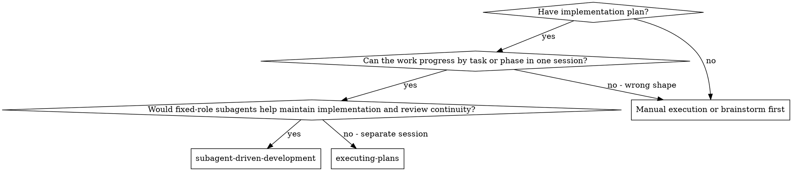
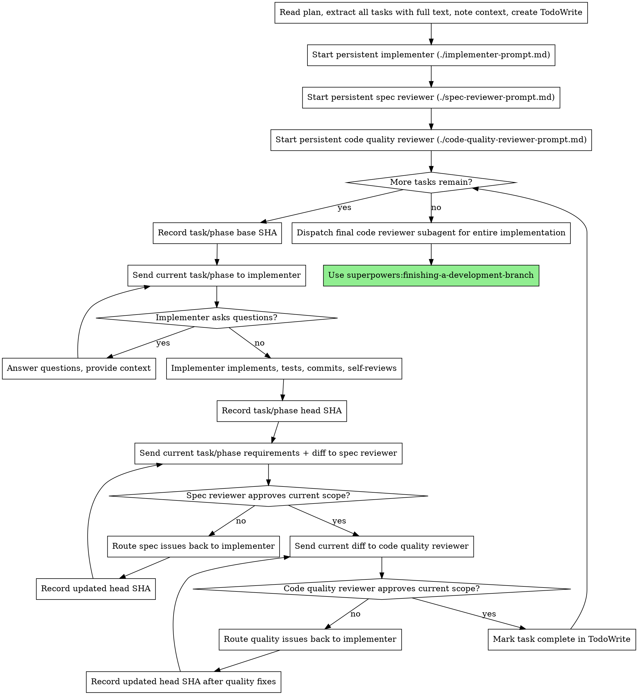

# Subagent Role Granularity Implementation Plan

> **For agentic workers:** REQUIRED SUB-SKILL: Use superpowers:subagent-driven-development (recommended) to implement this plan with fixed-role subagents for implementation, spec review, and code quality review, or superpowers:executing-plans for inline execution. Steps use checkbox (`- [ ]`) syntax for tracking.

**Goal:** Migrate `subagent-driven-development` from per-task fresh subagent dispatch to fixed-role subagents that persist across the full execution run.

**Architecture:** Update the skill narrative, flowchart, and prompt templates so controller semantics become role-oriented rather than task-instantiation-oriented. Keep task/phase-based plan progression and two-stage review order intact, but make implementer, spec-reviewer, and code-quality-reviewer persistent roles. For this task, verification ends with code/spec consistency checks and user manual review instead of automated test execution.

**Tech Stack:** Markdown skill docs, prompt templates, shell-based regression tests, repository docs

---

### Task 1: Rewrite subagent-driven-development skill narrative

**Files:**
- Modify: `skills/subagent-driven-development/SKILL.md`
- Reference: `docs/superpowers/specs/2026-05-28-subagent-role-granularity-design.md`

- [ ] **Step 1: Replace the frontmatter description with fixed-role wording**

```md
---
name: subagent-driven-development
description: Use when you have a written implementation plan and want to execute it in the current session using fixed-role subagents for implementation, spec review, and code quality review
---
```

- [ ] **Step 2: Replace the overview and core principle to describe persistent roles**

Replace the opening block with this content:

```md
# Subagent-Driven Development

Execute a written plan using fixed-role subagents: one persistent implementer, one persistent spec reviewer, and one persistent code quality reviewer, with two-stage review after each task or phase.

**Why subagents:** You delegate work to specialized agents with isolated context. By precisely crafting their instructions and context, you ensure they stay focused and succeed at their role. They should never inherit your full session history — you construct exactly what they need. This also preserves your own context for coordination work.

**Core principle:** Fixed role ownership + task-scoped review loops (spec then quality) = consistent execution, clearer accountability, and high quality
```

- [ ] **Step 3: Rewrite the “When to Use” flow so it no longer depends on fresh-per-task assumptions**

Replace the existing `## When to Use` graph with:



Then replace the bullets immediately below it with:

```md
**vs. Executing Plans (parallel session):**
- Same session (no context switch)
- Fixed-role subagents preserve implementation and review continuity across tasks
- Two-stage review after each task or phase: spec compliance first, then code quality
- Faster iteration (no human-in-loop between tasks)
```
```

- [ ] **Step 4: Add explicit fixed-role scope discipline to the acceptance rules**

In `## Phase Acceptance Rules`, append this bullet after the existing “Run code quality review...” line:

```md
- Persistent reviewers may remember earlier phases, but must still review the current task or phase against its own requirements and diff by default
```

- [ ] **Step 5: Replace the process graph with role initialization + per-task routing**

Replace the entire `## The Process` graph with:



- [ ] **Step 6: Rewrite status handling, prompt template notes, example workflow, advantages, and red flags around persistent roles**

Apply these exact replacements:

1. In `## Handling Implementer Status`, change the opening sentence to:

```md
The persistent implementer role reports one of four statuses for each task or phase. Handle each appropriately:
```

2. In the `NEEDS_CONTEXT` bullet, replace `re-dispatch` with `send the missing context and ask the same implementer role to continue`.

3. In the `BLOCKED` numbered list, replace:

```md
1. If it's a context problem, provide more context and re-dispatch with the same model
2. If the task requires more reasoning, re-dispatch with a more capable model
```

with:

```md
1. If it's a context problem, provide more context and let the same implementer role continue
2. If the task requires more reasoning, either upgrade the implementer model or replace the implementer role explicitly
```

4. In `## Prompt Templates`, replace the bullets with:

```md
- `./implementer-prompt.md` - Start and guide the persistent implementer role
- `./spec-reviewer-prompt.md` - Start and guide the persistent spec compliance reviewer role
- `./code-quality-reviewer-prompt.md` - Start and guide the persistent code quality reviewer role
```

5. Replace the entire `## Example Workflow` section with a shorter fixed-role example:

```md
## Example Workflow

```text
You: I'm using Subagent-Driven Development to execute this plan.

[Read plan file once: docs/superpowers/plans/feature-plan.md]
[Extract all tasks with full text and context]
[Create TodoWrite with all tasks]
[Start persistent implementer]
[Start persistent spec-reviewer]
[Start persistent code-quality-reviewer]

Task 1:
[Send Task 1 text + context to implementer]
[Implementer reports DONE]
[Send Task 1 requirements + diff to spec-reviewer]
[Spec-reviewer approves]
[Send Task 1 diff to code-quality-reviewer]
[Code-quality-reviewer approves]
[Mark Task 1 complete]

Task 2:
[Send Task 2 text + context to same implementer]
[Implementer reports DONE_WITH_CONCERNS]
[Send Task 2 requirements + diff to same spec-reviewer]
[Spec-reviewer finds a missing requirement]
[Route issue back to same implementer]
[Implementer fixes and reports back]
[Re-run spec review]
[Run code quality review]
[Mark Task 2 complete]

...

[After all tasks]
[Dispatch final code reviewer]
[Use superpowers:finishing-a-development-branch]
```
```

6. In `## Advantages`, replace:
- `Fresh context per task (no confusion)`
- `More subagent invocations (implementer + 2 reviewers per task)`
- `Controller does more prep work (extracting all tasks upfront)`

with:
- `Stable role ownership across tasks (less repeated onboarding)`
- `Fewer role restarts during a long execution run`
- `Controller invests upfront in role setup, then routes task-scoped context through the same roles`

7. In `## Red Flags`, replace:
- `If reviewer finds issues: Implementer (same subagent) fixes them`
- `If subagent fails task: Dispatch fix subagent with specific instructions`

with:
- `If reviewer finds issues: the same implementer role fixes them`
- `If the implementer role fails repeatedly: upgrade or replace the role explicitly; do not silently start ad-hoc fix agents`
```

- [ ] **Step 7: Manually review the file for leftover per-task/fresh-role wording**

Run:

```bash
rg -n "fresh subagent per task|Dispatch implementer subagent|Implementer subagent|same subagent|task-by-task" skills/subagent-driven-development/SKILL.md
```

Expected: only intentional mentions remain, or no matches.

### Task 2: Rewrite persistent-role prompt templates

**Files:**
- Modify: `skills/subagent-driven-development/implementer-prompt.md`
- Modify: `skills/subagent-driven-development/spec-reviewer-prompt.md`
- Modify: `skills/subagent-driven-development/code-quality-reviewer-prompt.md`
- Reference: `docs/superpowers/specs/2026-05-28-subagent-role-granularity-design.md`

- [ ] **Step 1: Rewrite implementer prompt as a persistent role prompt**

Replace the template body in `skills/subagent-driven-development/implementer-prompt.md` so the opening becomes:

```md
# Implementer Role Prompt Template

Use this template when starting the persistent implementer role for an execution run.

```
Task tool (general-purpose):
  description: "Start implementer role for [plan name]"
  prompt: |
    You are the persistent implementer role for this execution run.

    You will receive one task or phase at a time from the controller. Your job is to implement the current task exactly as specified, report status clearly, and stay available for follow-up fixes on later review cycles.

    ## Execution Run Context

    [PLAN GOAL, architecture context, constraints, branch/worktree context]

    ## How to Work

    - Treat each incoming task or phase as the active scope
    - Keep continuity across tasks, but do not start future tasks early
    - Do not expand scope based on memory from earlier tasks
    - If a reviewer sends issues back, fix only those issues plus any directly necessary adjustments
```
```

- [ ] **Step 2: Update the implementer reporting and escalation wording for role continuity**

In the same file, ensure these exact points exist in the template:

```md
## Status Per Task or Phase

When you finish a task or phase, report:
- **Status:** DONE | DONE_WITH_CONCERNS | BLOCKED | NEEDS_CONTEXT
- What you implemented
- What you changed
- What you verified yourself
- Self-review findings
- Any issues or concerns

After reporting, remain ready for the next task or for reviewer feedback on this one.
```

And replace any wording that implies the implementer exits permanently after one task.

- [ ] **Step 3: Rewrite spec-reviewer prompt as a persistent reviewer role**

Update `skills/subagent-driven-development/spec-reviewer-prompt.md` so the template framing becomes:

```md
# Spec Compliance Reviewer Role Prompt Template

Use this template when starting the persistent spec compliance reviewer role for an execution run.
```

And change the prompt introduction to:

```md
You are the persistent spec compliance reviewer for this execution run.

You will receive one task or phase at a time. For each review, judge the current task or phase against its own requirements and diff by default.
```

Add this rule below the existing scope guidance:

```md
You may remember earlier accepted phases, but that memory does not widen the current review scope by default.
```

- [ ] **Step 4: Rewrite code-quality-reviewer prompt as a persistent reviewer role**

Update `skills/subagent-driven-development/code-quality-reviewer-prompt.md` so the framing becomes:

```md
# Code Quality Reviewer Role Prompt Template

Use this template when starting the persistent code quality reviewer role for an execution run.
```

Then insert this paragraph before the template block:

```md
You are the persistent code quality reviewer for this execution run. You review one task or phase at a time, keep continuity across the run, and still judge current quality issues primarily from the current diff.
```

- [ ] **Step 5: Run a targeted wording scan across the prompt templates**

Run:

```bash
rg -n "Task N|single task|same subagent|dispatch implementer subagent|persistent implementer|persistent spec|persistent code quality" skills/subagent-driven-development/*.md
```

Expected: the persistent-role wording is present, and obsolete single-task framing is removed where it changes behavior.

### Task 3: Update writing-plans handoff language to match the new execution model

**Files:**
- Modify: `skills/writing-plans/SKILL.md`
- Reference: `docs/superpowers/specs/2026-05-28-subagent-role-granularity-design.md`

- [ ] **Step 1: Replace the required header snippet**

In `skills/writing-plans/SKILL.md`, replace the plan header example block line:

```md
> **For agentic workers:** REQUIRED SUB-SKILL: Use superpowers:subagent-driven-development (recommended) or superpowers:executing-plans to implement this plan task-by-task. Steps use checkbox (`- [ ]`) syntax for tracking.
```

with:

```md
> **For agentic workers:** REQUIRED SUB-SKILL: Use superpowers:subagent-driven-development (recommended) to implement this plan with fixed-role subagents for implementation, spec review, and code quality review, or superpowers:executing-plans for inline execution. Steps use checkbox (`- [ ]`) syntax for tracking.
```

- [ ] **Step 2: Replace the execution handoff choice text**

In the `## Execution Handoff` section, replace:

```md
**1. Subagent-Driven (recommended)** - I dispatch a fresh subagent per task, review between tasks, fast iteration
```

with:

```md
**1. Subagent-Driven (recommended)** - I use fixed-role subagents for implementation, spec review, and code quality review, with review loops between tasks
```

Then replace:

```md
- Fresh subagent per task + two-stage review
```

with:

```md
- Fixed-role subagents + two-stage review
```

- [ ] **Step 3: Scan for outdated task-instantiation wording in writing-plans**

Run:

```bash
rg -n "fresh subagent per task|task-by-task" skills/writing-plans/SKILL.md
```

Expected: no stale execution-handoff wording remains.

### Task 4: Update user-facing docs and request prompts that teach the old model

**Files:**
- Modify: `README.md`
- Modify: `tests/explicit-skill-requests/prompts/after-planning-flow.txt`
- Modify: `tests/explicit-skill-requests/prompts/claude-suggested-it.txt`

- [ ] **Step 1: Update the README skill summary**

In `README.md`, replace the subagent-driven bullet summary with wording that says it uses fixed-role subagents across the execution run, while preserving the two-stage review description.

Use this replacement text:

```md
4. **subagent-driven-development** or **executing-plans** - Activates with plan. Uses fixed-role subagents for implementation, spec compliance review, and code quality review across the execution run, or executes inline in batches with human checkpoints.
```

- [ ] **Step 2: Update explicit request prompt fixtures to the new wording**

In `tests/explicit-skill-requests/prompts/after-planning-flow.txt`, replace:

```text
1. Subagent-Driven (this session) - dispatch a fresh subagent per task
```

with:

```text
1. Subagent-Driven (this session) - use fixed-role subagents across the execution run
```

In `tests/explicit-skill-requests/prompts/claude-suggested-it.txt`, replace:

```text
1. Subagent-Driven (this session) - I dispatch a fresh subagent per task, review between tasks, fast iteration within this conversation
```

with:

```text
1. Subagent-Driven (this session) - I use fixed-role subagents across the execution run, review between tasks, and keep fast iteration within this conversation
```

- [ ] **Step 3: Run a repo scan for high-priority stale wording outside historical plans/specs**

Run:

```bash
rg -n "fresh subagent per task|task-by-task" README.md skills tests/explicit-skill-requests/prompts
```

Expected: no stale wording remains in active skill/docs/prompt surfaces outside intentionally historical files.

### Task 5: Update the subagent-driven-development tests to reflect the new role model

**Files:**
- Modify: `tests/claude-code/test-subagent-driven-development.sh`
- Modify: `tests/claude-code/test-subagent-driven-development-integration.sh`
- Reference: `docs/superpowers/specs/2026-05-28-subagent-role-granularity-design.md`

- [ ] **Step 1: Update the text test to assert persistent-role language**

In `tests/claude-code/test-subagent-driven-development.sh`, keep the existing checks for:
- loading the plan
- spec compliance before code quality
- self-review
- reading plan once
- skepticism in spec review
- review loops
- full task text provision
- worktree requirement
- main branch warning

Add or replace assertions so the script also checks for:

```bash
assert_contains "$output" "persistent implementer\|fixed-role\|fixed role" "Mentions persistent role model"
assert_contains "$output" "spec-reviewer\|spec reviewer" "Mentions persistent spec reviewer"
assert_contains "$output" "code-quality-reviewer\|code quality reviewer" "Mentions persistent code quality reviewer"
assert_not_contains "$output" "fresh subagent per task" "Does not present fresh-per-task as core model"
```

- [ ] **Step 2: Update the integration test expectations from per-task creation to role continuity**

In `tests/claude-code/test-subagent-driven-development-integration.sh`:

1. Replace the introductory checklist text so it verifies:

```text
1. Fixed-role subagents are established for the execution run
2. The same role model is used across multiple tasks
3. Full task text provided to the implementer role
4. Spec compliance review before code quality review
5. Review loops when issues are found
6. Spec reviewer reads code independently
```

2. Replace comments and grep expectations that explicitly assume “fresh subagent per task”.

3. Add transcript assertions that look for persistent role wording in the conversation, for example:

```bash
grep -qE "persistent implementer|fixed-role subagents|fixed role subagents" "$SESSION_FILE"
```

4. Keep the end-to-end implementation correctness checks for `src/math.js`, `test/math.test.js`, and `npm test` in the script source intact for future automation, but do not run this test as part of this task.

- [ ] **Step 3: Perform a non-executing test review pass instead of running automated tests**

Because this task uses user manual review instead of automated test execution, do not run `test-subagent-driven-development.sh` or `test-subagent-driven-development-integration.sh`.

Instead, run:

```bash
git diff -- tests/claude-code/test-subagent-driven-development.sh tests/claude-code/test-subagent-driven-development-integration.sh
```

Expected: the assertions and prose reflect persistent fixed-role subagents, while script structure remains coherent.

### Task 6: Final consistency review and prepare for user manual inspection

**Files:**
- Modify: all files changed in Tasks 1-5

- [ ] **Step 1: Run a focused diff review on all touched files**

Run:

```bash
git diff -- skills/subagent-driven-development/SKILL.md \
  skills/subagent-driven-development/implementer-prompt.md \
  skills/subagent-driven-development/spec-reviewer-prompt.md \
  skills/subagent-driven-development/code-quality-reviewer-prompt.md \
  skills/writing-plans/SKILL.md \
  README.md \
  tests/explicit-skill-requests/prompts/after-planning-flow.txt \
  tests/explicit-skill-requests/prompts/claude-suggested-it.txt \
  tests/claude-code/test-subagent-driven-development.sh \
  tests/claude-code/test-subagent-driven-development-integration.sh
```

Expected: every user-facing and test-facing active surface tells the same fixed-role story.

- [ ] **Step 2: Run a final stale-phrase sweep across active surfaces**

Run:

```bash
rg -n "fresh subagent per task|dispatch a fresh subagent per task|implement this plan task-by-task|Implementer subagent fixes|same subagent" \
  skills/subagent-driven-development \
  skills/writing-plans/SKILL.md \
  README.md \
  tests/explicit-skill-requests/prompts \
  tests/claude-code
```

Expected: no stale core phrasing remains in active execution guidance or tests, except where historical context is explicitly intentional.

- [ ] **Step 3: Prepare the result for user manual review**

Do not run automated tests for this task.

Instead, after the edits are complete:
- summarize the fixed-role execution model changes
- call out the updated files
- explicitly tell the user that automated test execution was skipped per instruction
- ask the user to manually inspect the diff and wording changes
