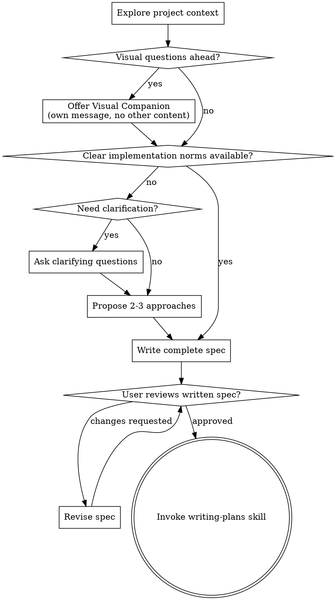

# Brainstorming Ideas Into Designs

Help turn ideas into fully formed designs and specs through natural collaborative dialogue.

Start by understanding the current project context, then ask questions one at a time to refine the idea. Once you understand what you're building, present the design and get user approval.

<HARD-GATE>
Do NOT invoke any implementation skill, write any code, scaffold any project, or take any implementation action until you have presented a design and the user has approved it. This applies to EVERY project regardless of perceived simplicity.
</HARD-GATE>

## Anti-Pattern: "This Is Too Simple To Need A Design"

Every project goes through this process. A todo list, a single-function utility, a config change — all of them. "Simple" projects are where unexamined assumptions cause the most wasted work. The design can be short (a few sentences for truly simple projects), but you MUST present it and get approval.

## Checklist

You MUST create a task for each of these items and complete them in order:

1. **Explore project context** — check files, docs, recent commits
2. **Offer visual companion** (if topic will involve visual questions) — this is its own message, not combined with a clarifying question. See the Visual Companion section below.
3. **Decide whether clarification is actually needed** — identify whether existing norms already define the implementation path
4. **Ask clarifying questions only when needed** — one at a time, only to resolve true ambiguity, missing implementation detail, or mutually exclusive approaches
5. **Propose 2-3 approaches** — with trade-offs and your recommendation when a real decision remains
6. **Write the complete design/spec** — when information is sufficient, generate the full spec instead of confirming design sections one by one
7. **Write design doc** — save to `docs/superpowers/specs/YYYY-MM-DD-<topic>-design.md` and commit
8. **Spec self-review** — quick inline check for placeholders, contradictions, ambiguity, scope (see below)
9. **User reviews written spec** — ask user to review the spec file before proceeding
10. **Transition to implementation** — invoke writing-plans skill to create implementation plan

## Process Flow

**The terminal state is invoking writing-plans.** Do NOT invoke frontend-design, mcp-builder, or any other implementation skill. The ONLY skill you invoke after brainstorming is writing-plans.

## The Process

**Understanding the idea:**

- Check out the current project state first (files, docs, recent commits)
- Before asking detailed questions, assess scope: if the request describes multiple independent subsystems (e.g., "build a platform with chat, file storage, billing, and analytics"), flag this immediately. Don't spend questions refining details of a project that needs to be decomposed first.
- If the project is too large for a single spec, help the user decompose into sub-projects: what are the independent pieces, how do they relate, what order should they be built? Then brainstorm the first sub-project through the normal design flow. Each sub-project gets its own spec → plan → implementation cycle.
- Before asking any clarifying question, determine whether the repository and the current conversation already define a clear implementation path.
- Treat existing docs, stable code patterns, and explicit user instructions as implementation norms.
- If those norms already answer the key design questions, do not ask clarifying questions. Proceed directly to the complete design/spec, write it to the standard location, and present a short summary for review.
- For appropriately-scoped projects without a clear implementation path, ask questions one at a time to refine the idea.
- Prefer multiple choice questions when possible, but open-ended is fine too.
- Only one question per message. If a topic needs more exploration, break it into multiple questions.
- Focus questions on what is required to resolve purpose, constraints, success criteria, or mutually exclusive implementation paths.
- Never ask a question whose answer is already clear from repository norms or explicit user instructions.

**Exploring approaches:**

- Propose 2-3 different approaches with trade-offs when a real design choice remains.
- Present options conversationally with your recommendation and reasoning.
- Lead with your recommended option and explain why.
- If repository norms already determine the path, do not invent artificial alternatives just to satisfy the workflow.

**Presenting the design:**

- Once you believe you understand what you're building, write the complete design/spec.
- When the user already supplied enough information, do not present the design in section-by-section approval loops.
- Instead, write the complete spec to the standard location and present a short summary that helps the user review it quickly.
- If earlier clarification exposed a real design decision, make that decision explicit in the spec and include the trade-off in your summary.
- Cover: architecture, components, data flow, error handling, testing, and a Task Decomposition Overview (see below).
- Be ready to revise the written spec if something doesn't make sense.

**Design for isolation and clarity:**

- Break the system into smaller units that each have one clear purpose, communicate through well-defined interfaces, and can be understood and tested independently
- For each unit, you should be able to answer: what does it do, how do you use it, and what does it depend on?
- Can someone understand what a unit does without reading its internals? Can you change the internals without breaking consumers? If not, the boundaries need work.
- Smaller, well-bounded units are also easier for you to work with - you reason better about code you can hold in context at once, and your edits are more reliable when files are focused. When a file grows large, that's often a signal that it's doing too much.

**Task Decomposition Overview (tiered):**

The spec is the human-reviewable artifact; the plan is not. So decide the coarse task breakdown here, where design context is richest, and let writing-plans refine it into steps. Include a "Task Decomposition Overview" section in the spec, sized to complexity:

- **Simple** (a single coherent unit, clear path, few tasks): one line — "Single plannable unit; the plan skill will slice it into tasks."
- **Complex** (spans multiple units, the split is not unique, or ordering affects rework): provide
  1. a behavior-level task breakdown (NOT bite-sized steps),
  2. the dependency order (what to build first to reduce rework/uncertainty), and
  3. a sizing check — each item must be completable within one plan; if any item is too big, decompose it into a sub-project/sub-spec.

Do NOT put bite-sized implementation steps in the spec — those belong in the plan. The spec only locks the behavior-level breakdown, ordering, and sizing.

**Working in existing codebases:**

- Explore the current structure before proposing changes. Follow existing patterns.
- Where existing code has problems that affect the work (e.g., a file that's grown too large, unclear boundaries, tangled responsibilities), include targeted improvements as part of the design - the way a good developer improves code they're working in.
- Don't propose unrelated refactoring. Stay focused on what serves the current goal.

## After the Design

**Documentation:**

- Write the validated design (spec) to `docs/superpowers/specs/YYYY-MM-DD-<topic>-design.md`
  - (User preferences for spec location override this default)
- Use elements-of-style:writing-clearly-and-concisely skill if available
- Commit the design document to git

**Spec Self-Review:**
After writing the spec document, look at it with fresh eyes:

1. **Placeholder scan:** Any "TBD", "TODO", incomplete sections, or vague requirements? Fix them.
2. **Internal consistency:** Do any sections contradict each other? Does the architecture match the feature descriptions?
3. **Scope check:** Is this focused enough for a single implementation plan, or does it need decomposition?
4. **Ambiguity check:** Could any requirement be interpreted two different ways? If so, pick one and make it explicit.

Fix any issues inline. No need to re-review — just fix and move on.

**User Review Gate:**
After the spec review loop passes, ask the user to review the written spec before proceeding. Give them the file path plus a short summary of the main decisions and boundaries:

> "Spec written to `<path>`. Summary: <2-4 sentence overview of the key design decisions, changed behavior, and review focus>. Please review the spec and let me know if you want any changes before we start writing the implementation plan."

Wait for the user's response. If they request changes, make them and re-run the spec review loop. Only proceed once the user approves.

**Implementation:**

- Invoke the writing-plans skill to create a detailed implementation plan
- Do NOT invoke any other skill. writing-plans is the next step.

## Key Principles

- **Norms first** - If the project already has clear implementation norms, follow them and skip unnecessary questions.
- **One question at a time when questions are necessary** - Don't overwhelm the user when real clarification is needed.
- **Multiple choice preferred** - Easier to answer than open-ended when possible.
- **YAGNI ruthlessly** - Remove unnecessary features from all designs.
- **Explore alternatives only when real choices remain** - Don't manufacture options when the path is already determined.
- **Review at the spec level** - When information is sufficient, write the full spec first and ask the user to review the document rather than approving design sections one by one.
- **Be flexible** - Go back and clarify when something doesn't make sense.

## Visual Companion

A browser-based companion for showing mockups, diagrams, and visual options during brainstorming. Available as a tool — not a mode. Accepting the companion means it's available for questions that benefit from visual treatment; it does NOT mean every question goes through the browser.

**Offering the companion:** When you anticipate that upcoming questions will involve visual content (mockups, layouts, diagrams), offer it once for consent:
> "Some of what we're working on might be easier to explain if I can show it to you in a web browser. I can put together mockups, diagrams, comparisons, and other visuals as we go. This feature is still new and can be token-intensive. Want to try it? (Requires opening a local URL)"

**This offer MUST be its own message.** Do not combine it with clarifying questions, context summaries, or any other content. The message should contain ONLY the offer above and nothing else. Wait for the user's response before continuing. If they decline, proceed with text-only brainstorming.

**Per-question decision:** Even after the user accepts, decide FOR EACH QUESTION whether to use the browser or the terminal. The test: **would the user understand this better by seeing it than reading it?**

- **Use the browser** for content that IS visual — mockups, wireframes, layout comparisons, architecture diagrams, side-by-side visual designs
- **Use the terminal** for content that is text — requirements questions, conceptual choices, tradeoff lists, A/B/C/D text options, scope decisions

A question about a UI topic is not automatically a visual question. "What does personality mean in this context?" is a conceptual question — use the terminal. "Which wizard layout works better?" is a visual question — use the browser.

If they agree to the companion, read the detailed guide before proceeding:
`skills/brainstorming/visual-companion.md`
