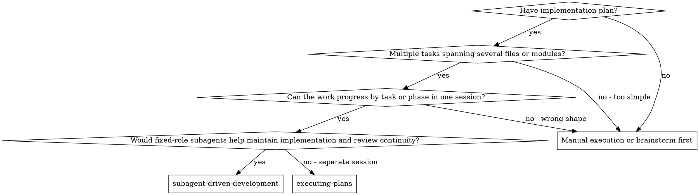
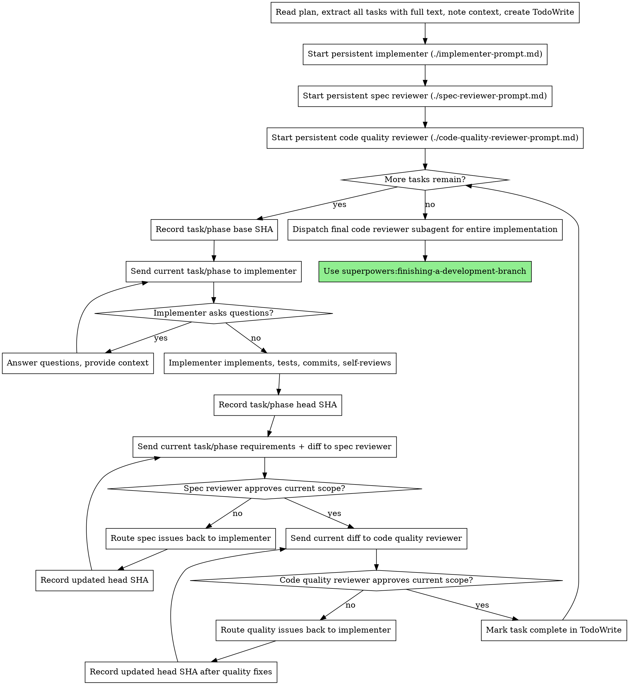

# Subagent-Driven Development

Execute a written plan using fixed-role subagents: one persistent implementer, one persistent spec reviewer, and one persistent code quality reviewer, with two-stage review after each task or phase.

**Why subagents:** You delegate work to specialized agents with isolated context. By precisely crafting their instructions and context, you ensure they stay focused and succeed at their role. They should never inherit your full session history — you construct exactly what they need. This also preserves your own context for coordination work.

**Core principle:** Fixed role ownership + task-scoped review loops (spec then quality) = consistent execution, clearer accountability, and high quality

**Continuous execution:** Do not pause to check in with your human partner between tasks. Execute all tasks from the plan without stopping. The only reasons to stop are: BLOCKED status you cannot resolve, ambiguity that genuinely prevents progress, or all tasks complete. "Should I continue?" prompts and progress summaries waste their time — they asked you to execute the plan, so execute it.

## When to Use



**vs. Executing Plans (parallel session):**
- Same session (no context switch)
- Fixed-role subagents preserve implementation and review continuity across tasks
- Two-stage review after each task or phase: spec compliance first, then code quality
- Faster iteration (no human-in-loop between tasks)

## Phase Acceptance Rules

When a larger feature spans multiple tasks or phases, review each phase against its own requirements and its own diff range.

For each task or phase:
- Record a task/phase base SHA before implementation starts
- Record a task/phase head SHA after implementation changes are complete
- Run spec compliance review against only that task or phase's requirements and diff
- Run code quality review against only that task or phase's diff
- Persistent reviewers may remember earlier phases, but must still review the current task or phase against its own requirements and diff by default

Treat previously accepted work as closed by default. Reopen it only when:
- The current task or phase modified it
- The current task or phase materially depends on it
- A problem outside the current diff makes the current task or phase invalid

If later phases reveal an earlier issue that is real but unchanged in the current diff, record it as an out-of-scope observation unless it blocks the current phase.

Use a full-implementation review at the end for holistic concerns across all phases. Do not repeatedly re-review earlier accepted phases at every checkpoint.

## The Process



## Model Selection

Use the least powerful model that can handle each role to conserve cost and increase speed.

**Mechanical implementation tasks** (isolated functions, clear specs, 1-2 files): use a fast, cheap model. Most implementation tasks are mechanical when the plan is well-specified.

**Integration and judgment tasks** (multi-file coordination, pattern matching, debugging): use a standard model.

**Architecture, design, and review tasks**: use the most capable available model.

**Task complexity signals:**
- Touches 1-2 files with a complete spec → cheap model
- Touches multiple files with integration concerns → standard model
- Requires design judgment or broad codebase understanding → most capable model

## Handling Implementer Status

The persistent implementer role reports one of four statuses for each task or phase. Handle each appropriately:

**DONE:** Proceed to spec compliance review.

**DONE_WITH_CONCERNS:** The implementer completed the work but flagged doubts. Read the concerns before proceeding. If the concerns are about correctness or scope, address them before review. If they're observations (e.g., "this file is getting large"), note them and proceed to review.

**NEEDS_CONTEXT:** The implementer needs information that wasn't provided. Provide the missing context and ask the same implementer role to continue.

**BLOCKED:** The implementer cannot complete the task. Assess the blocker:
1. If it's a context problem, provide more context and let the same implementer role continue
2. If the task requires more reasoning, either upgrade the implementer model or replace the implementer role explicitly
3. If the task is too large, break it into smaller pieces
4. If the plan itself is wrong, escalate to the human

**Never** ignore an escalation or force the same model to retry without changes. If the implementer said it's stuck, something needs to change.

## Prompt Templates

- `./implementer-prompt.md` - Start and guide the persistent implementer role
- `./spec-reviewer-prompt.md` - Start and guide the persistent spec compliance reviewer role
- `./code-quality-reviewer-prompt.md` - Start and guide the persistent code quality reviewer role

## Example Workflow

```text
You: I'm using Subagent-Driven Development to execute this plan.

[Read plan file once: docs/superpowers/plans/feature-plan.md]
[Extract all tasks with full text and context]
[Create TodoWrite with all tasks]
[Start persistent implementer]
[Start persistent spec-reviewer]
[Start persistent code-quality-reviewer]

Task 1:
[Send Task 1 text + context to implementer]
[Implementer reports DONE]
[Send Task 1 requirements + diff to spec-reviewer]
[Spec-reviewer approves]
[Send Task 1 diff to code-quality-reviewer]
[Code-quality-reviewer approves]
[Mark Task 1 complete]

Task 2:
[Send Task 2 text + context to same implementer]
[Implementer reports DONE_WITH_CONCERNS]
[Send Task 2 requirements + diff to same spec-reviewer]
[Spec-reviewer finds a missing requirement]
[Route issue back to same implementer]
[Implementer fixes and reports back]
[Re-run spec review]
[Run code quality review]
[Mark Task 2 complete]

...

[After all tasks]
[Dispatch final code reviewer]
[Use superpowers:finishing-a-development-branch]
```

## Advantages

**vs. Manual execution:**
- Subagents follow TDD naturally
- Stable role ownership across tasks (less repeated onboarding)
- Parallel-safe (roles don't interfere)
- Roles can ask questions (before AND during work)

**vs. Executing Plans:**
- Same session (no handoff)
- Continuous progress (no waiting)
- Review checkpoints automatic

**Efficiency gains:**
- No file reading overhead (controller provides full text)
- Controller curates exactly what context is needed
- Subagent gets complete information upfront
- Questions surfaced before work begins (not after)
- Fewer role restarts during a long execution run
- Controller invests upfront in role setup, then routes task-scoped context through the same roles

**Quality gates:**
- Self-review catches issues before handoff
- Two-stage review: spec compliance, then code quality
- Review loops ensure fixes actually work
- Spec compliance prevents over/under-building
- Code quality ensures implementation is well-built

**Cost:**
- Persistent roles accumulate more local context and need tighter scope discipline
- Controller does upfront setup work before task routing begins
- Review loops add iterations
- But catches issues early (cheaper than debugging later)

## Red Flags

**Never:**
- Start implementation on the base branch itself (for example main/master) without explicit user consent; if the output branch is the same branch, that still requires explicit user consent
- Skip reviews (spec compliance OR code quality)
- Proceed with unfixed issues
- Dispatch multiple implementation subagents in parallel (conflicts)
- Make subagent read plan file (provide full text instead)
- Skip scene-setting context (subagent needs to understand where task fits)
- Ignore subagent questions (answer before letting them proceed)
- Accept "close enough" on spec compliance (spec reviewer found issues = not done)
- Skip review loops (reviewer found issues = implementer fixes = review again)
- Let implementer self-review replace actual review (both are needed)
- **Start code quality review before spec compliance is ✅** (wrong order)
- Move to next task while either review has open issues

**If subagent asks questions:**
- Answer clearly and completely
- Provide additional context if needed
- Don't rush them into implementation

**If reviewer finds issues:**
- The same implementer role fixes them
- Reviewer reviews again
- Repeat until approved
- Don't skip the re-review

**If the implementer role fails repeatedly:**
- Upgrade or replace the role explicitly
- Don't silently start ad-hoc fix agents
- Don't try to fix manually (context pollution)

## Integration

**Required workflow skills:**
- **superpowers:using-git-worktrees** - Ensures isolated workspace (creates one or verifies existing)
- **superpowers:writing-plans** - Creates the plan this skill executes
- **superpowers:requesting-code-review** - Code review template for reviewer subagents
- **superpowers:finishing-a-development-branch** - Complete development after all tasks

**Subagents should use:**
- **superpowers:test-driven-development** - Subagents start with the highest natural failing test, usually E2E or integration first, and only drop to smaller tests when failures or anomalies require diagnosis

**Alternative workflow:**
- **superpowers:executing-plans** - Use for parallel session instead of same-session execution
