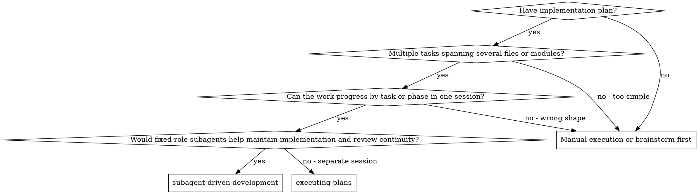
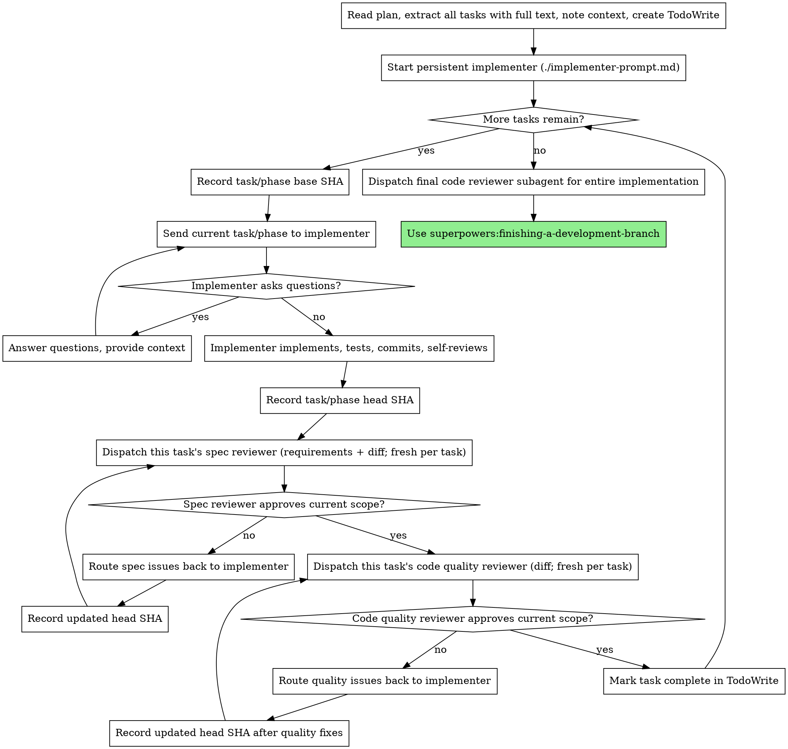

# Subagent-Driven Development

Execute a written plan using fixed-role subagents with a hybrid lifecycle: one persistent implementer (continued across tasks via SendMessage to preserve codebase continuity), plus a fresh spec reviewer and a fresh code quality reviewer dispatched per task (no cross-task memory, so each review stays independent), with two-stage review after each task or phase.

**Why subagents:** You delegate work to specialized agents with isolated context. By precisely crafting their instructions and context, you ensure they stay focused and succeed at their role. They should never inherit your full session history — you construct exactly what they need. This also preserves your own context for coordination work.

**Core principle:** Fixed role ownership + task-scoped review loops (spec then quality) = consistent execution, clearer accountability, and high quality

**Continuous execution:** Do not pause to check in with your human partner between tasks. Execute all tasks from the plan without stopping. The only reasons to stop are: BLOCKED status you cannot resolve, ambiguity that genuinely prevents progress, or all tasks complete. "Should I continue?" prompts and progress summaries waste their time — they asked you to execute the plan, so execute it.

## When to Use



**vs. Executing Plans (parallel session):**
- Same session (no context switch)
- Fixed-role subagents preserve implementation and review continuity across tasks
- Two-stage review after each task or phase: spec compliance first, then code quality
- Faster iteration (no human-in-loop between tasks)

## Phase Acceptance Rules

When a larger feature spans multiple tasks or phases, review each phase against its own requirements and its own diff range.

For each task or phase:
- Record a task/phase base SHA before implementation starts
- Record a task/phase head SHA after implementation changes are complete
- Run spec compliance review against only that task or phase's requirements and diff
- Run code quality review against only that task or phase's diff
- Dispatch a fresh spec reviewer and a fresh code quality reviewer for each task or phase, carrying no memory of earlier tasks — independence is the whole point of review. Within a single task's review loop, a re-check after the implementer fixes issues continues that same reviewer (it already raised the issue); each new task always gets a freshly dispatched reviewer.

Treat previously accepted work as closed by default. Reopen it only when:
- The current task or phase modified it
- The current task or phase materially depends on it
- A problem outside the current diff makes the current task or phase invalid

If later phases reveal an earlier issue that is real but unchanged in the current diff, record it as an out-of-scope observation unless it blocks the current phase.

Use a full-implementation review at the end for holistic concerns across all phases. Do not repeatedly re-review earlier accepted phases at every checkpoint.

## The Process



> **Reviewer lifecycle note:** Only the implementer is started up front. Each task dispatches its own fresh spec and code-quality reviewers. In the diagram, the loop back to a reviewer node after a fix means *continue that task's same reviewer* on the updated diff (task-internal re-check), not a brand-new dispatch — a fresh dispatch happens only when a new task begins.

## Model Selection

Design happens on the orchestrator; execution and verification happen on subagents. Split the models along that line:

**Design phase — orchestrator (Opus).** Brainstorming the spec and writing the plan are judgment-heavy and run in the main session. Keep the session on the most capable model (Opus). The orchestrator that runs this skill also stays on Opus to coordinate, review status, and resolve escalations.

**Execution and verification — subagents (Sonnet).** Dispatch all three fixed roles — implementer, spec compliance reviewer, code quality reviewer — with the **Sonnet** model. Once the plan is well-specified, implementation, spec review, and quality review are execution work that Sonnet handles well at lower cost and higher speed.

**Escalation exception:** If a Sonnet implementer reports BLOCKED for a reason that is genuinely reasoning-bound (not a missing-context problem), the orchestrator MAY temporarily upgrade that one task to Opus — see "Handling Implementer Status." Default back to Sonnet for the next task.

## Implementer Checkpoint Reset (Optional — default off)

The implementer is the only role that persists across tasks, so on a very long plan its context can degrade. This reset is **off by default**; apply it only when the controller judges it necessary.

**Trigger when:** the implementer repeatedly errs, loses track of earlier decisions, or churns on NEEDS_CONTEXT — or after a pre-agreed number of tasks (K) on an unusually long plan.

**Action:** start a new implementer seeded with a compact handoff instead of the full accumulated context. The handoff contains:
- a short summary of completed tasks and their outcomes
- key decisions and conventions established so far
- the list of files touched and their responsibilities
- the current task's full text and local context

The fresh implementer takes over from the next task. Reviewers are unaffected — they are already fresh per task.

## Handling Implementer Status

The persistent implementer role reports one of four statuses for each task or phase. Handle each appropriately:

**DONE:** Proceed to spec compliance review.

**DONE_WITH_CONCERNS:** The implementer completed the work but flagged doubts. Read the concerns before proceeding. If the concerns are about correctness or scope, address them before review. If they're observations (e.g., "this file is getting large"), note them and proceed to review.

**NEEDS_CONTEXT:** The implementer needs information that wasn't provided. Provide the missing context and ask the same implementer role to continue.

**BLOCKED:** The implementer cannot complete the task. Assess the blocker:
1. If it's a context problem, provide more context and let the same implementer role continue
2. If the task requires more reasoning, either upgrade the implementer model or replace the implementer role explicitly
3. If the task is too large, break it into smaller pieces
4. If the plan itself is wrong, escalate to the human

**Never** ignore an escalation or force the same model to retry without changes. If the implementer said it's stuck, something needs to change.

## Prompt Templates

- `./implementer-prompt.md` - Start and guide the persistent implementer role
- `./spec-reviewer-prompt.md` - Dispatch a fresh spec compliance reviewer per task
- `./code-quality-reviewer-prompt.md` - Dispatch a fresh code quality reviewer per task

## Example Workflow

```text
You: I'm using Subagent-Driven Development to execute this plan.

[Read plan file once: docs/superpowers/plans/feature-plan.md]
[Extract all tasks with full text and context]
[Create TodoWrite with all tasks]
[Start persistent implementer]              # only the implementer is started up front

Task 1:
[SendMessage Task 1 text + context to implementer]
[Implementer reports DONE]
[Dispatch FRESH spec-reviewer with Task 1 requirements + diff]
[Spec-reviewer approves]
[Dispatch FRESH code-quality-reviewer with Task 1 diff]
[Code-quality-reviewer approves]
[Mark Task 1 complete — both reviewers discarded]

Task 2:
[SendMessage Task 2 text + context to SAME implementer]
[Implementer reports DONE_WITH_CONCERNS]
[Dispatch FRESH spec-reviewer with Task 2 requirements + diff]   # new agent, no memory of Task 1
[Spec-reviewer finds a missing requirement]
[Route issue back to same implementer via SendMessage]
[Implementer fixes and reports back]
[CONTINUE the same Task 2 spec-reviewer to re-check the fix]     # task-internal continue
[Spec-reviewer approves]
[Dispatch FRESH code-quality-reviewer with Task 2 diff]
[Code-quality-reviewer approves]
[Mark Task 2 complete]

...

[After all tasks]
[Dispatch final code reviewer]
[Use superpowers:finishing-a-development-branch]
```

## Advantages

**vs. Manual execution:**
- Subagents follow TDD naturally
- Stable role ownership across tasks (less repeated onboarding)
- Parallel-safe (roles don't interfere)
- Roles can ask questions (before AND during work)

**vs. Executing Plans:**
- Same session (no handoff)
- Continuous progress (no waiting)
- Review checkpoints automatic

**Efficiency gains:**
- No file reading overhead (controller provides full text)
- Controller curates exactly what context is needed
- Subagent gets complete information upfront
- Questions surfaced before work begins (not after)
- Fewer role restarts during a long execution run
- Controller invests upfront in implementer setup, then routes task-scoped context through the persistent implementer while giving each task an independently dispatched reviewer

**Quality gates:**
- Self-review catches issues before handoff
- Two-stage review: spec compliance, then code quality
- Review loops ensure fixes actually work
- Spec compliance prevents over/under-building
- Code quality ensures implementation is well-built
- Per-task fresh reviewers carry no accumulated bias from earlier tasks, so each review is genuinely independent

**Cost:**
- The persistent implementer accumulates local context and needs scope discipline (and, on very long plans, an optional checkpoint reset — see "Implementer Checkpoint Reset"); fresh per-task reviewers avoid this accumulation entirely
- Controller does upfront setup work before task routing begins
- Review loops add iterations
- But catches issues early (cheaper than debugging later)

## Red Flags

**Never:**
- Start implementation on the base branch itself (for example main/master) without explicit user consent; if the output branch is the same branch, that still requires explicit user consent
- Skip reviews (spec compliance OR code quality)
- Proceed with unfixed issues
- Dispatch multiple implementation subagents in parallel (conflicts)
- Make subagent read plan file (provide full text instead)
- Skip scene-setting context (subagent needs to understand where task fits)
- Ignore subagent questions (answer before letting them proceed)
- Accept "close enough" on spec compliance (spec reviewer found issues = not done)
- Skip review loops (reviewer found issues = implementer fixes = review again)
- Let implementer self-review replace actual review (both are needed)
- **Start code quality review before spec compliance is ✅** (wrong order)
- Move to next task while either review has open issues
- Carry reviewer context across tasks — each task gets a freshly dispatched reviewer with no memory of earlier tasks
- Reuse a prior task's reviewer for a new task

**If subagent asks questions:**
- Answer clearly and completely
- Provide additional context if needed
- Don't rush them into implementation

**If reviewer finds issues:**
- The same implementer role fixes them
- The same task's reviewer (continued within this task's loop) reviews again — do not spin up a new reviewer mid-task
- Repeat until approved
- Don't skip the re-review

**If the implementer role fails repeatedly:**
- Upgrade or replace the role explicitly (or apply a checkpoint reset — see "Implementer Checkpoint Reset")
- Don't silently start ad-hoc fix agents
- Don't try to fix manually (context pollution)

## Integration

**Required workflow skills:**
- **superpowers:using-git-worktrees** - Ensures isolated workspace (creates one or verifies existing)
- **superpowers:writing-plans** - Creates the plan this skill executes
- **superpowers:requesting-code-review** - Code review template for reviewer subagents
- **superpowers:finishing-a-development-branch** - Complete development after all tasks

**Subagents should use:**
- **superpowers:test-driven-development** - Subagents start with the highest natural failing test, usually E2E or integration first, and only drop to smaller tests when failures or anomalies require diagnosis

**Alternative workflow:**
- **superpowers:executing-plans** - Use for parallel session instead of same-session execution
