# Test-Driven Development (TDD)

## Overview

Write the test first. By default, start with a relatively complex E2E or integration test that proves the real workflow should work. Only drop to smaller tests when the larger test fails or exposes stability or performance issues.

**Core principle:** If you didn't watch the test fail, you don't know if it tests the right thing.

**Default stance:** Prove the full behavior path first. Use smaller tests to diagnose, not as the automatic starting ritual.

**Violating the letter of the rules is violating the spirit of the rules.**

## When to Use

**Always:**
- New features
- Bug fixes
- Refactoring
- Behavior changes

**Default starting point:**
- Workflow-heavy features
- Cross-file behavior changes
- User-visible flows
- Skill behavior or orchestration changes

**Exception path (still test-first):**
- Pure utility functions
- Pure parsing/transform logic
- Low-level modules with no natural end-to-end flow

Thinking "skip TDD just this once"? Stop. That's rationalization.

## The Iron Law

```
NO PRODUCTION CODE WITHOUT A FAILING TEST FIRST
```

By default, that failing test should be a relatively complex E2E or integration test that exercises the real behavior path.

Write code before the test? Delete it. Start over.

**No exceptions:**
- Don't keep it as "reference"
- Don't "adapt" it while writing tests
- Don't look at it
- Delete means delete

Implement fresh from tests. Period.

## Red-Green-Refactor

```dot
digraph tdd_cycle {
    rankdir=LR;
    red [label="RED\nWrite failing E2E/integration test", shape=box, style=filled, fillcolor="#ffcccc"];
    verify_red [label="Verify fails\nfor expected reason", shape=diamond];
    green [label="GREEN\nMinimal implementation", shape=box, style=filled, fillcolor="#ccffcc"];
    verify_green [label="Verify large test\npasses cleanly", shape=diamond];
    down [label="Drop down\nto smaller tests?", shape=diamond];
    diagnose [label="Write focused module/unit tests\nto diagnose", shape=box, style=filled, fillcolor="#fff2cc"];
    refactor [label="REFACTOR\nClean up", shape=box, style=filled, fillcolor="#ccccff"];
    next [label="Next", shape=ellipse];

    red -> verify_red;
    verify_red -> green [label="yes"];
    verify_red -> red [label="wrong failure"];
    green -> verify_green;
    verify_green -> down [label="yes"];
    verify_green -> green [label="no"];
    down -> refactor [label="no"];
    down -> diagnose [label="yes"];
    diagnose -> green [label="fix root cause"];
    refactor -> next;
}
```



### RED - Write the first failing test at the right level

For normal feature work, start by writing one relatively complex E2E or integration test that proves the real workflow should work.

That first test should:
- Cover the main value path, not an internal helper
- Use a relatively complex, representative input
- Fail because the feature is missing or behavior is wrong

If the task has no natural end-to-end flow, use a smaller-scope failing test instead — but still start with the highest level that naturally expresses the behavior.

<Good>
```typescript
test('publishing a draft article shows it on the public page', async () => {
  const article = {
    title: 'TDD at scale',
    body: 'Long-form content',
    tags: ['testing', 'workflow'],
    publishAt: '2026-05-14T10:00:00Z',
  };

  const draftId = await createDraft(article);
  await publishDraft(draftId);

  const page = await fetchPublicArticlePage(draftId);

  expect(page.status).toBe(200);
  expect(page.body).toContain(article.title);
  expect(page.body).toContain('testing');
});
```
Proves the real workflow with representative input
</Good>

<Bad>
```typescript
test('slugify works', () => {
  expect(slugify('TDD at scale')).toBe('tdd-at-scale');
});
```
Useful only if the large test fails and slug generation becomes the suspected cause
</Bad>

### Verify RED - Watch it fail

**MANDATORY. Never skip.**

Run the test you just wrote and confirm:
- It fails (not errors)
- It fails for the expected reason
- The failure corresponds to missing behavior, not a typo or broken harness

**Test passes?** You're not testing the new behavior.

**Test errors?** Fix the test or harness issue until it fails for the right reason.

### GREEN - Implement just enough to satisfy the large test

Write the minimum implementation needed to make the large-granularity test pass.

Don't start by scattering unit tests across internal helpers unless the large test failure forces you to investigate.

### Drop down only when warranted

Smaller module or unit tests are for diagnosis, not default ceremony.

Drop down only when:
- The large test fails and the root cause is unclear
- The behavior is flaky, timing-sensitive, or unstable
- Performance or resource issues need local isolation

Once the issue is understood and fixed, return to the large test and prove the full path still works.

### REFACTOR - Clean up after the full path is stable

After the large test passes reliably:
- Remove duplication
- Improve names
- Simplify structure

Do not backfill unit tests for every new function by default. Add smaller tests only where they continue to carry diagnostic or regression value. Drop-down diagnostic tests you write here do not need to be kept long-term — the superpowers:finishing-a-development-branch curation gate decides what enters the baseline before merge, so don't keep a test out of fear of deleting it.

## Good Tests

| Quality | Good | Bad |
|---------|------|-----|
| **Right starting level** | First test proves the real workflow | First test only checks an internal helper by habit |
| **Representative input** | Uses relatively complex, realistic input | Uses only trivial happy-path input |
| **Diagnostic drop-down** | Smaller tests appear after failure signals | Smaller tests are the automatic starting ritual |
| **Clear** | Name describes behavior | `test('test1')` |

## Why Order Matters

**"I'll add the E2E after implementation"**

That's tests-after, not TDD. You'd be verifying what you already built instead of forcing yourself to define the intended behavior first.

**"I'll start with smaller tests because they're easier"**

Ease is not the goal. Starting too low drags you into local loops before you've proved the actual workflow matters.

**"The large test passed, so now I should add unit tests for every function"**

Not by default. Smaller tests need a purpose: diagnosis, regression isolation, or a natural no-E2E exception path.

**"A simple happy-path input is enough"**

The first test should be representative enough to expose realistic integration or workflow failures. Trivial inputs hide the very problems you're trying to catch early.

## Common Rationalizations

| Excuse | Reality |
|--------|---------|
| "I'll start with a few unit tests to be safe" | That drags you into local loops before proving the real path. |
| "E2E is too big, I'll add it after implementation" | That's tests-after, not TDD. |
| "The big test passed, but I should still add unit tests for every function" | Not by default. Smaller tests need a reason. |
| "I prefer smaller tests first" | Preference is not a trigger. Failure or anomalies are triggers. |
| "A simple happy-path input is enough" | The first test should use a relatively complex, representative input. |
| "I can't diagnose this from E2E, so I'll just rewrite everything" | Drop down with focused tests, find the root cause, then return upward. |
| "This utility is too small for TDD" | Fine — use a smaller-scope failing test first, not implementation-first. |

## Red Flags - STOP and Start Over

- Code before test
- Test after implementation
- First test is a trivial happy-path check when the task naturally supports E2E
- Automatically writing unit tests before proving the full workflow
- Backfilling unit tests for every new function with no diagnostic reason
- "I'll add the E2E at the end"
- "This is different because I prefer smaller tests"

**All of these mean: Reset to a failing test first. Usually that means a larger-granularity test.**

## Example: Debugging After a Large Test Fails

**Large test fails:**
```typescript
test('checkout flow applies coupon to order total', async () => {
  const result = await completeCheckout({
    items: [{ sku: 'book', qty: 2 }],
    coupon: 'SPRING25',
    shippingCountry: 'US',
  });

  expect(result.total).toBe(30);
});
```

**Observed failure:** total is `40`, not `30`

**Drop down only now:**
```typescript
test('coupon engine applies percentage discounts to eligible carts', () => {
  const total = applyCoupon({ subtotal: 40, coupon: 'SPRING25' });
  expect(total).toBe(30);
});
```

The smaller test is justified because the large test already proved the workflow is broken and coupon calculation is now the suspected root cause.

## Verification Checklist

Before marking work complete:

- [ ] The first failing test was at the highest natural level for the task
- [ ] For normal feature work, that first test was E2E or integration scope
- [ ] The first test used relatively complex, representative input
- [ ] I watched the first test fail for the expected reason
- [ ] I only dropped to smaller tests when failure or anomalies justified it
- [ ] If I used smaller tests first, the task genuinely lacked a natural E2E path
- [ ] The large-granularity test passes at the end
- [ ] Output is pristine (no errors, warnings)

Can't check all boxes? You skipped the intended TDD flow.

## When Stuck

| Problem | Solution |
|---------|----------|
| Don't know what the first test should be | Write the workflow-level behavior you want the user to experience. |
| E2E feels awkward | Ask whether the task truly lacks a natural end-to-end path; if not, stay large-grain. |
| Failure is hard to localize | Add focused module or unit tests for diagnosis, then return upward. |
| Test setup is enormous | Simplify the interface or use the smallest realistic integration seam. |

## Debugging Integration

Bug found? Reproduce it with a failing test at the highest natural level. If the failing workflow test doesn't pinpoint the issue, add smaller tests to isolate the root cause, fix it, then prove the workflow again.

Never fix bugs without a test.

## Testing Anti-Patterns

When adding mocks or test utilities, read @testing-anti-patterns.md to avoid common pitfalls:
- Testing mock behavior instead of real behavior
- Adding test-only methods to production classes
- Mocking without understanding dependencies

## Final Rule

```
Production code → test exists and failed first
Default feature path → start with E2E/integration
Smaller tests → only when diagnosis or task shape requires them
Otherwise → not TDD
```

No exceptions without your human partner's permission.
